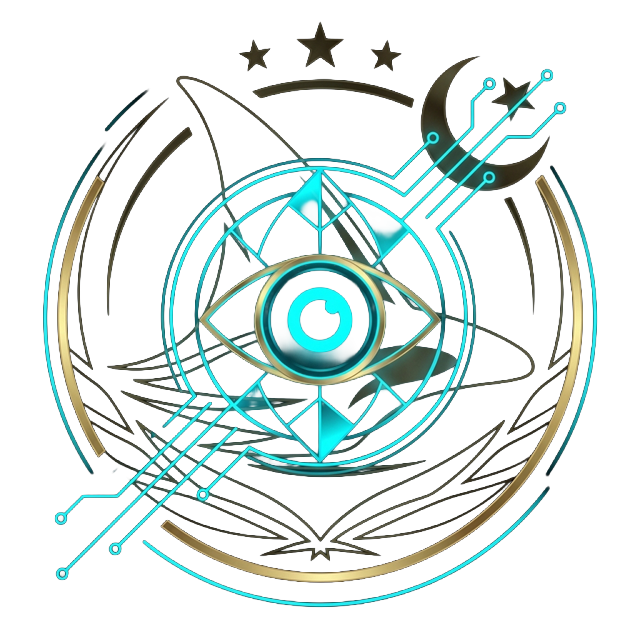

<p align="center">
  
</p>

# 🧠 OMNI /// AGI Edition (Formerly Neural Automater)

[](https://www.python.org/downloads/)
[](https://playwright.dev/)
[](#)
[](https://opensource.org/licenses/MIT)

**OMNI** is a deeply integrated, autonomous, AI-driven desktop computer application built entirely in Python. Far beyond a simple chatbot, OMNI acts as a literal **digital employee**—combining Advanced Local & Cloud Large Language Models (LLMs) with deep OS-level environment control ("God Mode") and stealth Playwright browser automation.

Whether you are looking to fully automate **WhatsApp messaging**, scrape live **Google Maps Business Intelligence**, run an autonomous **Social Media Comment Bot**, execute **Algorithmic Crypto Trades**, or command the AI to visually read your screen and navigate the web on **Auto-Pilot**, OMNI is the ultimate all-in-one Artificial General Intelligence (AGI) hub.

---

## 🚀 Why Choose OMNI? (SEO Key Highlights)
If you're searching for an **Autonomous Desktop AI Agent**, **Python Browser Automation Framework**, or a **Local AGI implementation**, OMNI offers unmatched flexibility:
- **Stealth Automation:** Uses heavily stealth-patched Chromium browsers to bypass bot-detection schemas (Cloudflare, Datadome).
- **Multi-LLM Freedom:** Plug in your choice of **Google Gemini (Cloud)**, **Ollama (True Local 100% Offline AI)**, or **OpenRouter** (Llama 3, Claude 3.5 Sonnet, OpenAI).
- **Physical "God Mode":** OMNI can take physical control of your mouse cursor and keyboard via `PyAutoGUI` or natively execute terminal Shell Commands in your local environment.

---

## 💎 Comprehensive Feature List

OMNI is divided into distinct, professionally engineered workstation tabs inside an elite "Dark Mode" GUI interface:

### 1. ⚡ Command Center & "Teach-By-Doing"
- **Stealth Initialization:** Launch a browser session that operates identical to a human.
- **Auto-Pilot Matrix:** Enter an objective like `"Find cheap flights to Tokyo"`. OMNI will take a screenshot, use an advanced Vision AI model to "see" the DOM, click buttons, wait for loads, and self-correct errors until the goal is mathematically complete.
- **Train-By-Demonstration:** Click `🔴 TRAIN`, manually perform a task in the browser (e.g. logging into your bank), and hit `SAVE`. OMNI memorizes the exact DOM interactions and can subsequently `▶ REPLAY` that identical human workflow autonomously forever.

### 2. 🔬 Elite Deep Research Engine
- **Autonomous Multi-Source Research:** Provide a deeply complex topic (e.g., *"Impact of AI on US Healthcare 2025"*).
- **AI Query Generation:** OMNI generates 5 diverse search queries to deeply investigate the premise.
- **Tri-Engine Search:** Scans Google, Bing, and Wikipedia.
- **Credibility Scoring:** Ranks and filters every source algorithmically (PubMed = 10/10, random blogs = 3/10).
- **Statistics Mining:** Extracts granular numerical data, percentages, and metrics from raw text.
- **Premium Academic Export:** Uses the LLM to synthesize the data into a **12-Section Academic Research Paper** exported seamlessly to highly-styled **MS Word (.docx)** and **Excel (.xlsx)** formats.

### 3. 🗂️ Business Intelligence (BIZ) Scraper
- **Google Maps Data Extraction:** Instantly scrape hundreds of targeted businesses.
- **Live Output Table:** Extracts Names, Categories, Addresses, Live Phone Numbers, Ratings, and Websites.
- **AI Enrichment:** OMNI's AI can fill in missing data points and write professional descriptions based on scraped context.
- **Smart Directory Save:** Prompts a native Windows "Save As" dialog to expertly export formatted Excel/CSV sheets exactly where you need them.

### 4. 🧠 Neural Chat & Memory Vault
- **Conversational Matrix:** A direct pipeline to your active LLM, complete with dynamic Persona switching (General Assistant, Expert Coder, Crypto Trader, Cold Email Writer).
- **Infinite Memory Vector:** OMNI permanently memorizes your interactions and writes them to a local SQLite database, establishing true long-term session intelligence.

### 5. 🐦 Social Media Pro (X / Twitter & LinkedIn)
- **AI Viral Content Generator:** Give it a topic, select your "Vibe" (Professional, Meme, Visionary), and have the AI write and natively post the content to your accounts.
- **Autonomous Auto-Comment Bot:** Specify a hashtag or URL. The AI will scroll, evaluate posts, generate highly-empathetic and contextual replies, and post them automatically at human-like random intervals to rapidly build your social presence.

### 6. 💬 WhatsApp Pro
- **Persistent Sessions:** Log in once utilizing OMNI’s secure caching.
- **Bulk Outreach:** Send personalized messages to hundreds of leads.
- **AI Auto-Responder:** Tell the AI: *"I am asleep, tell anyone who asks about the project that it launches on Tuesday."* The AI will read incoming messages, craft natural responses, and maintain conversations entirely hands-free.

### 7. ₿ Algorithmic Crypto Trader
- **Binance/Exchange Integration:** Connects securely to crypto markets.
- **Live Strategy Engine:** Run automated Technical Analysis strategies (Moving Average Crossovers, RSI divergence, MACD) on live price ticks.
- **Risk Management Protocols:** Hardcode stop-losses, maximum drawdown bounds, and positional sizing limits directly into the system.

### 8. 📡 Communications Hub (Email & Twilio)
- **Email Agent:** Generate and bulk-send heavily personalized cold emails through Gmail integration.
- **Twilio Voice & SMS:** Programmatically trigger SMS sequences or even synthesized VoIP phone calls directly to mobile phones around the globe.
- **Google Calendar Sync:** Read your upcoming events or have the AI proactively block out time in your calendar for your tasks.

---

## 🛠️ Detailed Installation & Setup Instructions

OMNI is built to run on **Windows 10/11**, **macOS**, and **Linux**.

### Prerequisites
- You must have **Python 3.10+** installed on your machine.
- Download Python here: [python.org/downloads](https://www.python.org/downloads/)
- Optional: Ensure you have `Git` installed to clone the project.

### Step 1: Clone the Repository
Open your Terminal or Command Prompt as **Administrator** (For God-Mode OS executions).
```bash
git clone https://github.com/naqashafzal/omni-agi-agent.git
cd omni-agi-agent
```

### Step 2: Create a Virtual Environment (Highly Recommended)
Creating an isolated environment ensures that dependencies don't conflict with your global Python setup.
```bash
# Windows
python -m venv venv
venv\Scripts\activate

# macOS / Linux
python3 -m venv venv
source venv/bin/activate
```

### Step 3: Install Core Dependencies
Install the required libraries listed in `requirements.txt`.
```bash
pip install -r requirements.txt
```
*Note: If you plan on using the Elite Research Engine export feature, ensure `python-docx` and `openpyxl` install successfully.*

### Step 4: Install Browser Automation Engines
OMNI uses Microsoft Playwright to interact with the web invisibly. You must install the browser binaries.
```bash
playwright install
```

### Step 5: Configure the AI Brain (API Key)
OMNI requires a "Brain" to function. You have two main options:

**Option A (Cloud AI - Easiest & Most Powerful for Vision):**
1. Go to [Google AI Studio](https://aistudio.google.com/).
2. Generate a free API key for the Gemini model (`gemini-2.5-pro` or `gemini-2.0-flash`).
3. You will paste this key inside the **SYSTEM SETTINGS** tab the first time you boot OMNI.

**Option B (Local Hardware AI - 100% Private):**
1. Download and install [Ollama](https://ollama.com/).
2. Open a terminal and pull a model: `ollama run llama3.2-vision`.
3. In OMNI's System Settings, swap the Provider to `Ollama`.

### Step 6: Launch
Fire up the OMNI Interface!
```bash
python gui_app.py
```

---

## ⚠️ Safety Warnings & Failsafes

1. **God Mode Risks:** If you check the ⚡ **GOD MODE** box in the Command Center, you are giving the LLM permission to execute raw shell commands on your Operating System (e.g. creating directories, reading secure files). **DO NOT** run untrusted workflows in God Mode unless you are monitoring the log heavily or using an isolated Virtual Machine (VM).
2. **PyAutoGUI Physical Failsafe:** When OMNI takes control of your physical mouse cursor, you might lose control of your machine. Feature a hard-coded Failsafe: violently drag your physical mouse perfectly into any of the **4 extreme corners** of your physical monitor. This immediately intentionally triggers a `FailSafeException` and aborts all Python threads.
3. **Data Privacy:** Your WhatsApp Sessions, browser cookies, and local memory (`agent_memory.db`) are encrypted and stored locally in the `/browser_profile` folder dynamically. Do not share your project directory publicly.

---

## 💡 About The Author

**Built with passion by Naqash Afzal — Project ORCA.**

I built this platform to push the boundaries of Agentic Automation. If you love this project, or just want to see insanely cool updates regarding open-source AGI, Neural Networks, and Automation Engineering:

- **Follow my GitHub:** [github.com/naqashafzal](https://github.com/naqashafzal)
- **Star ⭐ this Repository** to stay updated on future versions (v3.5 coming soon with Voice Agents!).

---

<p align="center">
  <i>"What if your computer could think for itself?" <br> Welcome to the future.</i>
</p>
